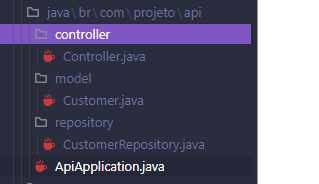
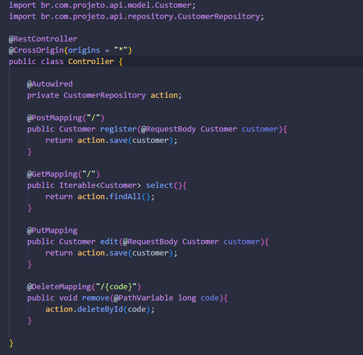
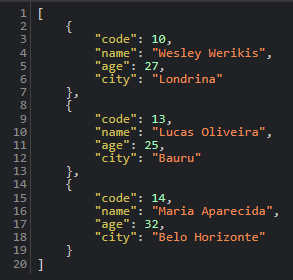

  <h1 style="border-bottom:none">API-BACK (SpringBoot & Angular) 👨‍💻</h1> 
  
   
Este projeto é fruto dos ensinamentos do Ralf Lima, onde foi abordado a integração entre o front e back-end. Para o front foi utilizado (Angular, HTML, CSS & TypeScript), já no back utilizei o (Java & frame SpringBoot) e por fim, banco de dados MySQL.

- Acesse a playlist do curso do professor Ralf [clicando aqui](https://www.youtube.com/watch?v=7lGaYV5Hjx4&list=PLWXw8Gu52TRLR24HGjSiVrE5MrkU5tWX-&index=1).

<h4>Tópicos abordados:</h4>
  
   + Criação de API em Spring Boot contendo os métodos: GET, POST, PUT e DELETE;
   + Criação de uma estrutura front-end em Angular para consumir a API.

<h2>Screen do Projeto: </h2>

+ Estrutura do projeto

+ Class Controller API

+ JSON Retornado no LOCALHOST:8080

  

<h2>Tecnologias utilizadas 💻</h2>

- ``Java, SpringBoot & Angular``
- ``HTML, CSS & TypeScript``
- ``MySQL``

## Conhecimentos adquiridos  
 * Desenvolver API REST com Spring Boot
 * Mapeamento objeto-relacional
 * Validações dos dados da requisição no back-end
 * Desenvolver front-end com Angular
 * Trabalhar com HTML, CSS e Typescript
 * Receber e enviar dados para a API

<h2>PROJETO FRONT-END</h2>

⚡ [API-FRONT-END](https://github.com/wesleywerikis/projeto-api-front) ⚡

